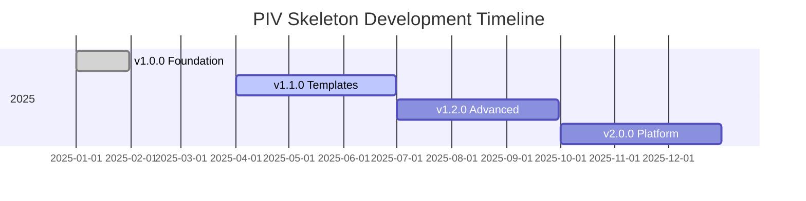

# PIV Skeleton Roadmap

**Future development plans and direction**

---

## Vision

Make PIV skeleton the **definitive resource** for Claude Code users implementing systematic AI-assisted development.

---

## Version 1.1.0 - Enhanced Templates (Q2 2025)

### New Technology Templates

- [ ] **Vue.js** - Frontend framework template
- [ ] **Angular** - Frontend framework template
- [ ] **Svelte** - Frontend framework template
- [ ] **MongoDB** - NoSQL database template
- [ ] **Redis** - Caching layer template
- [ ] **GraphQL** - API template with Apollo/Code-first

### Enhanced Documentation

- [ ] **Video tutorials** - 3-5 minute quick start videos
- [ ] **Interactive examples** - Runnable code examples
- [ ] **Migration guides** - From traditional development to PIV
- [ ] **Team adoption guide** - For teams adopting PIV

### Developer Experience

- [ ] **VS Code extension** - Quick access to PIV commands
- [ ] **Shell completion** - Auto-completion for PIV commands
- [ ] **Progress indicators** - Visual feedback during long operations
- [ ] **Configuration wizard** - Interactive setup for new projects

**Status:** 📋 Planning | **Help Wanted:** Yes

---

## Version 1.2.0 - Advanced Features (Q3 2025)

### Advanced Workflow Features

- [ ] **Conditional validation** - Skip validation for specific file types
- [ ] **Incremental prime** - Only reload changed context
- [ ] **Plan templates** - Reusable plan patterns
- [ ] **Multi-project prime** - Load context across multiple repos

### Integration Features

- [ ] **Jira integration** - Create issues from PIV plans
- [ ] **GitHub Actions** - CI/CD pipeline templates
- [ ] **Slack notifications** - Validation results to Slack
- [ ] **Notion integration** - Export plans to Notion

### Quality Enhancements

- [ ] **Performance metrics** - Track development velocity over time
- [ ] **Code quality trends** - Historical quality reports
- [ ] **Technical debt tracking** - Identify and track debt
- [ ] **Automated refactoring suggestions** - AI-driven improvements

**Status:** 🚧 Concept | **Help Wanted:** Yes

---

## Version 2.0.0 - Platform & Community (Q4 2025)

### Web Dashboard

- [ ] **PIV Hub** - Web interface for managing PIV projects
- [ ] **Plan visualization** - Visual representation of implementation plans
- [ ] **Progress tracking** - Track feature development across projects
- [ ] **Team analytics** - Aggregate metrics for teams

### Community Features

- [ ] **Rule marketplace** - Share and discover custom rules
- [ ] **Template gallery** - Community-contributed templates
- [ ] **Success stories** - Showcase of projects using PIV
- [ ] **Contributor leaderboard** - Recognize top contributors

### Advanced Integrations

- [ ] **IDE plugins** - JetBrains, VS Code, Neovim
- [ ] **API access** - Programmatic access to PIV features
- [ ] **Webhook support** - Custom integrations via webhooks
- [ ] **CLI tool** - Standalone CLI for PIV operations

**Status:** 💭 Exploration | **Help Wanted:** Yes

---

## Completed Features

### Version 1.0.0 - Foundation (Released)

✅ Universal PIV methodology implementation
✅ Technology templates (Spring Boot, React, Node.js, Python, PostgreSQL)
✅ Modular rules system
✅ Command infrastructure (Prime, Plan, Execute, Validate, Bug Fix)
✅ Comprehensive documentation
✅ Installer for existing projects
✅ GitHub issue/PR templates
✅ FAQ and troubleshooting guides
✅ Comparison documentation

**Released:** January 2025

---

## Experimental Features

These features are being explored but may not make it into future releases:

- [ ] **Multi-LLM support** - Use PIV with other AI models
- [ ] **Distributed prime** - Cache and share context across teams
- [ ] **Plan optimization** - AI suggests plan improvements
- [ ] **Predictive validation** - Anticipate issues before implementation
- [ ] **Auto-documentation** - Generate docs from code changes

**Status:** 🔬 Research | **Feedback Welcome:** Yes

---

## Contributing to Roadmap

### Suggest Features

We welcome feature suggestions! To propose a feature:

1. **Check existing issues** - Search for similar requests
2. **Open a feature request** - Use the feature request template
3. **Provide context** - Explain the use case and benefits
4. **Consider implementation** - Can you help build it?

### Help Wanted

Looking for contributors for:

- 🎨 **Design** - Logo, diagrams, UI mockups for web dashboard
- 📝 **Documentation** - Examples, tutorials, guides
- 🧪 **Testing** - Test across different technology stacks
- 🎥 **Video content** - Tutorial videos, demos
- 🌐 **Internationalization** - Translations
- 🔧 **Technology templates** - Add your favorite technology

### Contributing Timeline

We aim to release minor versions (1.x) every 2-3 months. Major versions (2.0) when we have significant new features.

**Want to influence the roadmap?**
- Join [GitHub Discussions](https://github.com/galando/claude-piv-skeleton/discussions)
- Participate in planning discussions
- Vote on feature requests
- Contribute to high-priority items

---

## Dependencies & Blockers

### External Dependencies

| Feature | Dependency | Status |
|---------|-----------|--------|
| VS Code extension | VS Code Extension API | ✅ Available |
| Web dashboard | Web framework selection | 🤷 Under evaluation |
| Performance metrics | Data storage solution | 🤷 Under evaluation |
| Multi-project prime | Claude Code API improvements | ⏳ Waiting for Claude Code features |

### Technical Blockers

- **Claude Code API**: Some features require Claude Code to expose additional APIs
- **Context sharing**: Requires Claude Code to support context export/import
- **Background operations**: Some features need background task support

**Workarounds:** We're implementing workarounds where possible, but some features need Claude Code platform improvements.

---

## Timeline

*Note: Timeline is approximate and subject to change based on contributor availability and feedback.*

---

## Prioritization Criteria

Features are prioritized based on:

1. **Community demand** - Features with most GitHub interest
2. **Implementation effort** - Quick wins vs. major features
3. **Strategic value** - Advances long-term vision
4. **Maintainability** - Sustainable to maintain long-term
5. **Dependencies** - Features blocked on external factors

**High Priority Indicators:**
- 🚀 **High demand** - Multiple community requests
- ⚡ **Quick win** - Low effort, high impact
- 🔒 **Blocker** - Unblocks other features
- ❤️ **Community love** - Positive feedback on concept

---

## Feedback & Iteration

This roadmap is **living document** and evolves based on:

- 📊 **Usage data** - Which features are most used
- 💬 **Community feedback** - GitHub issues and discussions
- 🔬 **Experimentation** - Testing new approaches
- 📈 **Adoption metrics** - Stars, forks, contributors

**Want to influence direction?**
- Vote on GitHub issues
- Participate in discussions
- Submit PRs for features you care about
- Share your PIV experiences

---

## Questions?

- See [FAQ](FAQ.md) for common questions
- Join [GitHub Discussions](https://github.com/galando/claude-piv-skeleton/discussions)
- Open a [feature request](https://github.com/galando/claude-piv-skeleton/issues/new?template=feature_request.md)

---

**Last Updated**: 2025-01-12

**Like what you see?** ⭐ [Star us on GitHub](https://github.com/galando/claude-piv-skeleton)
